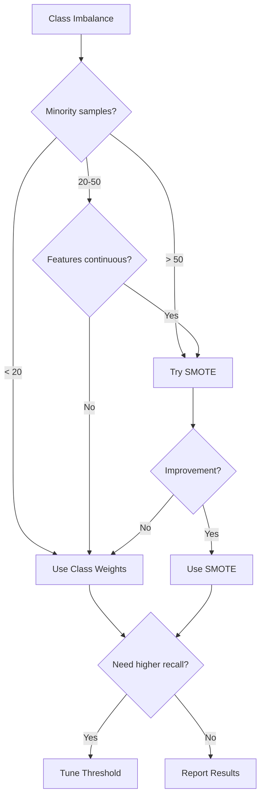

# Resampling vs Class Weighting

Two main approaches to handling class imbalance: resampling (SMOTE) and class weighting.

## Overview

| Approach | Mechanism | When to Use |
|----------|-----------|-------------|
| **SMOTE** | Create synthetic minority samples | Moderate imbalance, sufficient samples |
| **Class Weights** | Penalize majority class errors more | Any imbalance, small datasets |
| **Threshold Tuning** | Adjust decision boundary | Post-training adjustment |

## SMOTE (Synthetic Minority Over-sampling)

### How It Works

SMOTE creates new minority samples by interpolating between existing ones:

1. Select a minority sample
2. Find its k nearest minority neighbors
3. Create synthetic sample along line to a random neighbor

```
Original:     o   o   o   (minority)
                x x x x x x x (majority)

After SMOTE:  o s o s o s o   (s = synthetic)
                x x x x x x x
```

### Advantages

- Increases minority representation
- Helps models learn minority class boundaries
- Works well with distance-based models

### Disadvantages

- Can create unrealistic samples (especially in sparse regions)
- May introduce noise if minority samples are outliers
- Requires sufficient samples for meaningful interpolation

### Configuration

```python
config = TrainConfig(
    smote_mode="on",       # Enable SMOTE
    smote_k_neighbors=5,   # Neighbors for interpolation
)
```

### Variants

| Variant | Description |
|---------|-------------|
| **SMOTE** | Standard interpolation |
| **Borderline-SMOTE** | Focus on samples near decision boundary |
| **ADASYN** | Adaptive synthesis based on difficulty |
| **SMOTE-ENN** | SMOTE + undersampling via Edited Nearest Neighbors |

## Class Weighting

### How It Works

Assign higher weights to minority class samples, making their misclassification more costly:

```python
# Balanced weights: inversely proportional to class frequency
weights = {
    "Majority": 1.0,
    "Minority": 5.0,  # 5x weight if 5:1 imbalance
}
```

### Advantages

- No synthetic data created
- Works with any sample size
- Computationally efficient
- Preserves original data distribution

### Disadvantages

- Doesn't add information
- May not help with severe imbalance
- Can lead to unstable optimization

### Configuration

Class weights are applied automatically by sklearn estimators:

```python
from sklearn.linear_model import LogisticRegression

model = LogisticRegression(class_weight="balanced")
```

## Comparison

### When to Choose SMOTE

- Imbalance ratio 3:1 to 10:1
- At least 30 minority samples
- Continuous features
- Model benefits from more samples

### When to Choose Class Weights

- Very small minority class (<20 samples)
- Categorical or mixed features
- Severe imbalance (>10:1)
- Computational constraints

### Empirical Comparison

```python
from classiflow import train_binary_task, TrainConfig

# Run both approaches
config_smote = TrainConfig(smote_mode="on", ...)
config_weights = TrainConfig(smote_mode="off", ...)  # Models use balanced weights

results_smote = train_binary_task(config_smote)
results_weights = train_binary_task(config_weights)

# Compare metrics
print("SMOTE recall:", results_smote["summary"]["recall"]["mean"])
print("Weights recall:", results_weights["summary"]["recall"]["mean"])
```

## Threshold Tuning

A post-training alternative: adjust the decision threshold.

### Default Behavior

```python
# Default: predict class 1 if P(class=1) > 0.5
y_pred = (y_prob > 0.5).astype(int)
```

### Optimized Threshold

```python
from sklearn.metrics import precision_recall_curve

# Find threshold that maximizes F1
precision, recall, thresholds = precision_recall_curve(y_true, y_prob)
f1 = 2 * precision * recall / (precision + recall + 1e-10)
optimal_threshold = thresholds[np.argmax(f1[:-1])]

# Apply
y_pred = (y_prob > optimal_threshold).astype(int)
```

### Advantages

- No retraining required
- Precise control over precision-recall trade-off
- Can be tuned for specific operational requirements

### Disadvantages

- Requires holdout set for tuning
- Doesn't improve underlying model

## Combined Approaches

For severe imbalance, combine strategies:

```python
# 1. SMOTE for data augmentation
config = TrainConfig(smote_mode="on", ...)

# 2. Class weights in models (sklearn default with class_weight="balanced")
# 3. Threshold tuning on validation set
```

## Decision Guide



## Key Points

!!! tip "Always Compare"
    Use `smote_mode="both"` to empirically compare approaches on your data.

!!! warning "SMOTE Must Be Inside CV"
    Never apply SMOTE before train/test split.

!!! note "Report What You Used"
    In publications, clearly state your imbalance handling strategy.
