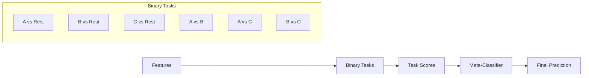

# Multiclass Classification Tutorial

This tutorial covers training classifiers for three or more classes using classiflow's meta-classifier approach.

## What You'll Learn

- How meta-classifiers work (OvR + pairwise ensembles)
- Configuring `train_meta_classifier`
- Adding custom composite tasks
- Interpreting multiclass outputs

## The Meta-Classifier Approach

Classiflow decomposes multiclass problems into binary tasks:

1. **One-vs-Rest (OvR)**: Each class vs. all others
2. **Pairwise**: Each pair of classes
3. **Composite** (optional): Custom class groupings

A meta-classifier then combines binary task scores to produce final predictions.



## Step 1: Prepare Multiclass Data

We'll use the Iris dataset (3 classes):

```python
import pandas as pd
from sklearn.datasets import load_iris
from pathlib import Path

# Load Iris dataset
data = load_iris()
df = pd.DataFrame(data.data, columns=data.feature_names)
df["species"] = [data.target_names[t] for t in data.target]
df["sample_id"] = [f"sample_{i:03d}" for i in range(len(df))]

# Save
output_dir = Path("outputs/02_multiclass_tutorial")
output_dir.mkdir(parents=True, exist_ok=True)
data_path = output_dir / "iris_data.csv"
df.to_csv(data_path, index=False)

print(f"Dataset: {df.shape}")
print(f"Classes: {df['species'].value_counts().to_dict()}")
```

Output:
```
Dataset: (150, 6)
Classes: {'setosa': 50, 'versicolor': 50, 'virginica': 50}
```

## Step 2: Configure Meta-Classifier

```python
from classiflow import MetaConfig

config = MetaConfig(
    # Data
    data_csv=data_path,
    label_col="species",
    classes=["setosa", "versicolor", "virginica"],

    # Output
    outdir=output_dir / "run",

    # Cross-validation
    outer_folds=5,
    inner_splits=3,
    inner_repeats=1,
    random_state=42,

    # SMOTE (balanced data, so off)
    smote_mode="off",
)

print("Binary tasks that will be created:")
print("  OvR: setosa_vs_Rest, versicolor_vs_Rest, virginica_vs_Rest")
print("  Pairwise: setosa_vs_versicolor, setosa_vs_virginica, versicolor_vs_virginica")
```

!!! info "Task Builder"
    The `TaskBuilder` class automatically generates OvR and pairwise tasks from your class list. You can also add custom composite tasks (see below).

## Step 3: Run Training

```python
from classiflow import train_meta_classifier
import logging

logging.basicConfig(level=logging.INFO)

results = train_meta_classifier(config)

print("\nTraining complete!")
print(f"Tasks trained: {len(results.get('task_results', {}))}")
```

This will:

1. Build 6 binary tasks (3 OvR + 3 pairwise)
2. Train each task with nested CV
3. Train a meta-classifier on binary task scores
4. Evaluate overall multiclass performance

## Step 4: Understand Binary Task Outputs

Each binary task produces a score indicating confidence in the positive class:

```python
import pandas as pd
import json

# Load best models per task
with open(output_dir / "run" / "fold_1" / "binary_none" / "best_models.json") as f:
    best_models = json.load(f)

print("Best model per task (fold 1):")
for task, model in best_models.items():
    print(f"  {task}: {model}")
```

Example output:
```
Best model per task (fold 1):
  setosa_vs_Rest: LogisticRegression
  versicolor_vs_Rest: SVC
  virginica_vs_Rest: RandomForest
  setosa_vs_versicolor: LogisticRegression
  setosa_vs_virginica: LogisticRegression
  versicolor_vs_virginica: SVC
```

## Step 5: Analyze Multiclass Results

```python
# Load summary metrics
summary = pd.read_csv(output_dir / "run" / "summary_metrics.csv")
print("Multiclass Summary Metrics:")
print(summary.to_string(index=False))
```

Expected metrics:
```
              metric   mean    std    min    max
            accuracy  0.967  0.027  0.933  1.000
   balanced_accuracy  0.967  0.027  0.933  1.000
            f1_macro  0.966  0.028  0.931  1.000
         f1_weighted  0.966  0.027  0.932  1.000
```

### Per-Class Metrics

```python
# Load detailed fold metrics
fold_dir = output_dir / "run" / "fold_1"
meta_results = fold_dir / "meta_none" / "meta_results.csv"

if meta_results.exists():
    meta_df = pd.read_csv(meta_results)
    print("\nPer-class metrics (fold 1):")
    print(meta_df.to_string(index=False))
```

## Step 6: Run Multiclass Inference

```python
from classiflow.inference import run_inference, InferenceConfig

# Test data
test_df = df.sample(n=30, random_state=456)
test_path = output_dir / "test_samples.csv"
test_df.to_csv(test_path, index=False)

# Inference
infer_config = InferenceConfig(
    run_dir=output_dir / "run",
    data_csv=test_path,
    output_dir=output_dir / "inference",
    id_col="sample_id",
    label_col="species",
)

results = run_inference(infer_config)

# View predictions
predictions = results["predictions"]
print("\nSample predictions:")
cols = ["sample_id", "species", "predicted_label"]
score_cols = [c for c in predictions.columns if c.endswith("_score")][:3]
print(predictions[cols + score_cols].head(10))
```

### Prediction Probabilities

The meta-classifier outputs per-class probabilities:

```python
proba_cols = [c for c in predictions.columns if c.startswith("predicted_proba_")]
print("\nClass probabilities:")
print(predictions[["sample_id", "predicted_label"] + proba_cols].head(5))
```

## Adding Custom Composite Tasks

For domain-specific groupings, add composite tasks:

```python
from classiflow.tasks import TaskBuilder, load_tasks_from_json

# Method 1: Programmatic
builder = TaskBuilder(classes=["setosa", "versicolor", "virginica"])
builder.build_all_auto_tasks()  # OvR + pairwise
builder.add_composite_task(
    name="setosa_vs_others",
    pos_classes=["setosa"],
    neg_classes="rest"
)
builder.add_composite_task(
    name="versicolor_or_virginica",
    pos_classes=["versicolor", "virginica"],
    neg_classes=["setosa"]
)

tasks = builder.get_tasks()
print(f"Total tasks: {len(tasks)}")
```

```python
# Method 2: JSON file
tasks_json = output_dir / "custom_tasks.json"

import json
custom_tasks = [
    {
        "name": "difficult_pair",
        "pos": ["versicolor"],
        "neg": ["virginica"]
    }
]
with open(tasks_json, "w") as f:
    json.dump(custom_tasks, f, indent=2)

# Use in config
config = MetaConfig(
    data_csv=data_path,
    label_col="species",
    classes=["setosa", "versicolor", "virginica"],
    tasks_json=tasks_json,  # Additional tasks from JSON
    tasks_only=False,  # False = add to auto tasks; True = only use JSON tasks
    outdir=output_dir / "run_with_custom",
)
```

## Visualizing Multiclass Results

```python
import matplotlib.pyplot as plt
from sklearn.metrics import ConfusionMatrixDisplay
import numpy as np

# Confusion matrix
y_true = predictions["species"]
y_pred = predictions["predicted_label"]

fig, ax = plt.subplots(figsize=(8, 6))
ConfusionMatrixDisplay.from_predictions(
    y_true, y_pred,
    display_labels=["setosa", "versicolor", "virginica"],
    ax=ax,
    cmap="Blues"
)
ax.set_title("Multiclass Confusion Matrix")
plt.tight_layout()
plt.savefig(output_dir / "confusion_matrix.png", dpi=150)
plt.show()
```

### Per-Class ROC Curves

```python
from sklearn.preprocessing import label_binarize
from sklearn.metrics import roc_curve, auc

# Binarize labels
classes = ["setosa", "versicolor", "virginica"]
y_true_bin = label_binarize(y_true, classes=classes)

fig, ax = plt.subplots(figsize=(8, 6))

for i, cls in enumerate(classes):
    proba_col = f"predicted_proba_{cls}"
    if proba_col in predictions.columns:
        fpr, tpr, _ = roc_curve(y_true_bin[:, i], predictions[proba_col])
        roc_auc = auc(fpr, tpr)
        ax.plot(fpr, tpr, label=f"{cls} (AUC={roc_auc:.3f})")

ax.plot([0, 1], [0, 1], "k--", label="Random")
ax.set_xlabel("False Positive Rate")
ax.set_ylabel("True Positive Rate")
ax.set_title("Per-Class ROC Curves")
ax.legend()
plt.tight_layout()
plt.savefig(output_dir / "roc_curves.png", dpi=150)
plt.show()
```

## Interpretation Notes

!!! note "Task Score Interpretation"
    - **OvR scores**: High score = sample likely belongs to that class
    - **Pairwise scores**: High score = sample more like class A than B
    - **Meta-classifier**: Combines all scores via logistic regression

!!! warning "Correlated Tasks"
    Pairwise tasks are not independent. The meta-classifier handles this, but be cautious interpreting individual task scores in isolation.

## What to Report

For multiclass results, report:

1. **Overall accuracy** and **balanced accuracy** (mean ± std)
2. **Per-class precision, recall, F1**
3. **Confusion matrix** (ideally as a figure)
4. **Number of binary tasks** used
5. **Meta-classifier regularization** (if tuned)

Example:

> Multiclass classification was performed using a meta-classifier trained on 6 binary tasks (3 one-vs-rest, 3 pairwise). The meta-classifier achieved a balanced accuracy of 0.967 (SD=0.027) across 5-fold nested cross-validation.

## Next Steps

- [Imbalanced Data Tutorial](imbalanced-data.md) - Handle unequal class sizes
- [Custom Tasks Guide](../how-to/configure-run.md) - Advanced task configuration
- [API Reference: TaskBuilder](../api/tasks.md) - Complete API documentation
